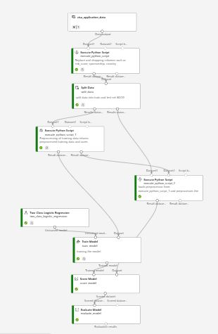

## CREATING AZURE ML PIPELINE WITH AZURE ML PYTHON SDK ON LOCAL SYSTEM
### PHASE 0
* Create a project folder
* Create a virtual environment (venv) inside project folder and install libraries in requirements.txt
* login into your azure account and create the following resources
    * Resource group
    * Storage Account
    * Azure ML workspace
    * Compute Instance or Cluster

### PHASE 1.1 - CONNECT TO YOUR WORKSPACE VIA SDK
* Create a .env file to store your environment variables such as sub id, names of resources e.t.c
* Create a jupyter notebook to establish connection to your workspace

* Create a yaml file to register your environment in conda-yamls

### PHASE 1.2 - UPLOAD YOUR DATA AND REGISTER AS A DATA ASSET
* Create a folder 'data' to house your data e.g. csv file
* use the code in the notebook to register your data as data asset

### PHASE 1.3 - UPLOAD AND REGISTER YOUR COMPONENTS
* Check the notebook for a better explanation and the code format
* Always remember to change the version of the components respective yml files if they have been changed

### PHASE 1.4 - CREATE AND RUN PIPELINE 
* Check the notebook for a better explanation and the code format
* Also change the components version here if they have also been changed
* replace the string in the compute variable with you compute instance or cluster name and don't forget to put them on before submitting the pipeline

---
## CREATING AZURE ML PIPELINE WITH DESIGNER ON AZURE ML STUDIO
### PHASE 0
* login into your azure account and create the following resources
    * Resource group
    * Storage Account
    * Azure ML workspace
    * Compute Instance or Cluster
    
### PHASE 1.1 - UPLOADING DATA AS A DATA ASSET
* Open Azure ML studio
* Open the menu on the left and select Data
* Go to datastore and create a new one
* Create a new data asset and link it to the data store to upload your data

### PHASE 1.2 - CREATE PIPELINE USING DESIGNER
* Now open the designer and create a new pipeline
* You can change the piipeline name at the top of the canvas
* On the left side you would see the Data and the Components tab side by side

### PHASE 1.3 - ADDING DATA AND COMPONENTS TO THE PIPELINE
* Go to the Data tab and then drag your data asset onto the canvas
* There are various components that can be used to abstract the complexity of machine learning pipelines you can research more on the components based on your need but here I would be using the following components:
    * Execute Python Script
    * Split Data
    * Two class Logistic Regression
    * Train Model
    * Score Model
    * Evaluate Model
* Connecting all these components is easy just to drag lines from the end of one component to another
* At the end of connecting all the components your pipeline can look something like this:

